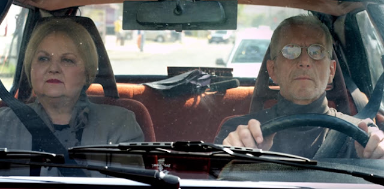
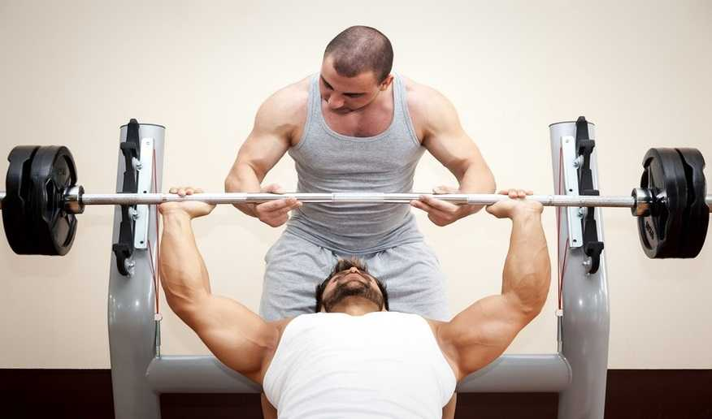
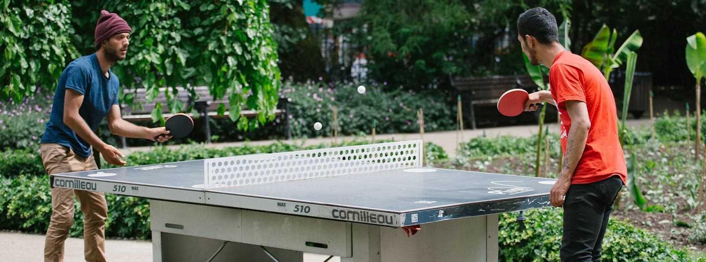
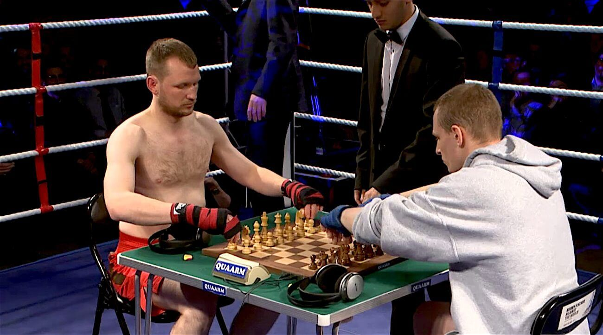

# Pair Programming

---

# Purpose

Or, like, what's the point of this workshop?

--

1. To think about _why_ we might pair

--

2. To learn about different techniques for pairing

--

3. To practice those techniques in a safe environment

---
# Reflect

--

Think about the _best_ experiences you've had working with other people.

--

What words describe those experiences?

---

# Why might pair programming not suit you?

---

## It's _exhausting_

Note: This is one of the most common reasons I hear for not wanting to pair, especially in a remote context - it's really tiring.

--

Pairing is _intense_

Note: And this is completely fair - pairing programming is tiring. Programming is already tiring, and pairing adds on this whole social aspect. It's like doing an exam, at a party.
--

It's super important to take _regular breaks_.

Note: Part of the problem is that people don't take breaks often enough when they're pairing. If you're working with a screen, you're supposed to take a quick break every 20 minute, plus a longer break every hour. Build that in to your pairing practice.
--

You don't have to spend all day coding

Note: You might do two sessions a day, of 2 hours apiece, for a total of 4 hours pairing. That leaves you the other half of your work day for reading, for learning, for writing, for going to meetings and so on.

---
## It's _boring_

Note: This is another objection I hear. It's _boring_ to watch someone else code, when you could be doing something more useful with your time, like doing your actual job.
--

Pairing should be fun

Note: This one makes me a little sad, because working with other people is supposed to be less lonely and boring. Somehow we've created a situation where people think that pairing means you sit on a video call and watch someone else type. If that's what you're doing, then you're right, that's boring and it's a waste of time. 
--

If you're watching someone type, _you're not pairing_

Note: I will die on this particular hill - if you can't grab the keyboard and show your partner what you mean, then it's not pair programming. 
---

## It's uncomfortable

Note: This is the biggest reason people don't like pairing, I think, and it's totally valid. Pair programming is awkward. A lot of us, myself included, are introverts. We ended up in computers because we're nerds and we don't like talking to people. Pair programming puts us straight outside of our comfort zone.
--

Pairing requires _trust_

Note: It's nerve wracking to type with someone else watching your every move and commenting on your lack of technical prowess. You have to feel safe with that person, and know that you're going to code better together than you would by yourself.
-- 

(What if my partner is better than me?)

--

It's useful to have a manual of me

Note: In your manual of me, include any requirements you have around breaks. For example - I have a fast metabolism, and I like to eat lunch at 12. If I don't eat lunch by 1, I'll get really cranky and unpleasant.

Sometimes when I'm thinking I stare off into the distance or close my eyes. I'm not having a stroke, I just have to focus. If I close my eyes while you're talking ot me, it's because I'm really really paying attention, don't worry.


---

# Strong Style

--
## The Driver

Writes code under the instruction of the navigator

--
## The Navigator

Directs the driver on what code to write

--

## One Rule

An idea can only pass from your head to the computer
by going through another person's hands

--
## The metaphor (intended)


Note: I think the driver/navigator metaphor is supposed to make you think of rally driving, because rally drivers are cool and sexy and exciting, and nerds all long to be cool, sexy, and exciting.

The metaphor doesn't quite work, though, because in a rally crew the navigator doesn't tell the driver what to do.
--
## The metaphor (corrected)


Note: So I think this is a much better metaphor. 

--

```
describe("when adding two numbers", () => {

  const calculator = new Calculator();
  calculator.input("+ 1 2");
  
  it("should give the sum", () => {
    expect(calculator.result).toBe(3)
  })

})
```
Note: Create a new class named "when adding two numbers", create a new Calculator, and check that "plus one two" should return three.
OR type "describe, open paren, open quote, when adding two numbers, close quote, comma, fat arrow, that's open/close paren, space equals space greater than, that's a fat arrow, brace"
--
The goal is mind-meld

Note: The idea behind strong style pairing is that both of you understand exactly where the code is going. It prevents the driver from racing ahead and leaving his partner behind. The goal is for both of you to have the same shared understanding of the solution. If the driver doesn't understand what they're being asked to do - they should ask questions. If the driver thinks they have a better idea, then the partners need to _swap positions_ so the driver becomes the navigator and can direct their partner.
---

# Practice

Let's take 30 minutes to pair on a kata using _strong style pairing_.

I'll interrupt after *15 minutes* to remind you to swap positions.
---

# How was that?

---

# Coaching Style

Note: In some sense, in coaching style we reverse the roles of navigator and driver.

--
## The Driver

Solves the problem by writing code.

--
## The Navigator

Asks questions and assists the driver.

--
## The metaphor



--
## A better metaphor


(#betterphor)

Notes: This guy is driving a forklift truck, and this guy here is called the spotter. what do you think he does?

--
## A betterer better metaphor




(#metabetterphor)

Notes: This guy is lifting weights, what's this guy doing? What's his role?

--

The goal is to perfect our practice

Notes: "what are you thinking?", "maybe we should revert and try again?", "I don't understand where this is going", "should we refactor at this point?"

---
# Practice

Let's take 30 minutes to pair on a kata using _coaching style pairing_.

--

I'll interrupt after *15 minutes* to remind you to swap positions.
---

# How was that?


---

# Ping-pong style

--
## The Driver

Solves the problem by writing code.

--
## The Navigator

Asks questions and assists the driver.

--
## The twist!

The driver writes code to pass one test...

---

Then writes a new _failing_ test ...

---

And the partners swap roles

--
## The metaphor



--
## An alternative metaphor



(This is not a #betterphor)

--

The goal is to _challenge the existing code_

--

Turns engineering into a _cooperative game_.

---
# Practice

Let's take 30 minutes to pair on a kata using _ping-pong style coaching_.
--

Remember to swap positions with each test.
---

# How was that?
